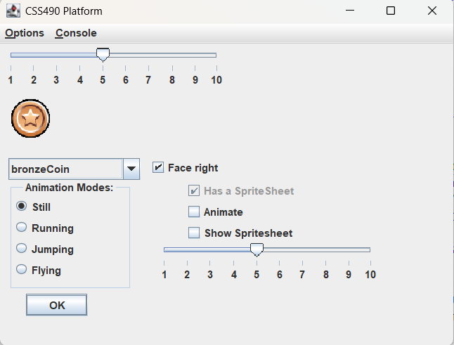

# Assignment One

Branch: Assignment-one = A working, completed assignment
Branch: Assignment-one-handout = A stubbed version to give to the students

The goals of this assignment are:  
* Get familiar with provided files and design 
* Learn basic Swing  
    * Create JFrame, JPanel  
    * Add Menus items  
    * Interfaces: method pointer and lambdas  
* MainFrame updates  
    * Add menu items  
* To get an Entity to draw and move around  
    * Logging of physics  
    * Debugging  
    * No Animation  
* Start on the Animations Dialog  
    * No Layout Managers. Use absolute pixel placement.   
    * Event Handlers   
    * Show image  
    * Show dropdown from image service  
* Start doing JUnit Testing  
* Create an Image Service  
    * Hard coded loading of image data (No JSON)   
* Use ApplicationContext singleton to get image & Logging services  
    * Logging Service Factory  
* Create a Data Service to load level & create EntityManager
    * Hard coded (No JSON)  


## Files
It is helpful to keep things similar. You will be directed to have certain files in your project.
You can add more, but you need to have the ones provided. This will keep the design similar and
will allow us to have a better dialog. Furthermore, there can be questions on assessments about specific
implementation.  

### Files to Work On  
```
├───gui
│       AnimationsDialog.java
│       Entity.java
│       MainFrame.java
│       MovingEntity.java
│
└───services
        Animation.java
        AnimationFactory.java
        DataService.java
        DataServiceProvider.java
        EntityManager.java
        HardCodedData.java
        ImageInfoRecord.java
        ImageService.java
        ImageServiceProvider.java
        LoadImageDataHelper.java
        LoggingFactory.java
        LoggingService.java
        PlaybackService.java
        ReadImageInfo.java
        SpriteSheetInfo.java
```


### Files for Free
```
├───gui
│       AnimationPanel.java
│       Entity.java
│       FallingEntity.java
│       GamePanel.java
│       Hero.java
│       HitEntity.java
│       Line.java
│       MainFrame.java
│       MovingEntity.java
│       ProgressExample.java
│       Turret.java
│
└───services
        Animation.java
        AnimationFactory.java
        DataService.java
        DataServiceProvider.java
        EntityManager.java
        HardCodedData.java
        ImageInfoRecord.java
        ImageService.java
        ImageServiceProvider.java
        LoadImageDataHelper.java
        LoggingFactory.java
        LoggingService.java
        PlaybackService.java
        ReadImageInfo.java
        SpriteSheetInfo.java
```

## Animations Dialog


